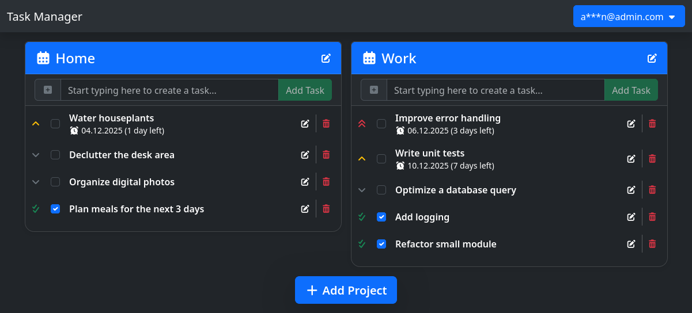

# Task Manager
<div align="center">
    
    <p>A simple task manager, powered by Django + HTMX + Alpine.js.</p>
</div>

## Prerequisites
- Python 3.13
- Podman or Docker

## Note for Windows users
Use `.\.venv\Scripts\activate` instead of `source ./.venv/bin/activate`, and use `python` instead of `python3` when running Django or installing packages.

## Note for Docker users
Both tools are fully compatible for this project. You can replace `podman-compose` with `docker compose` and everything will run the same way.

## Local Development Setup
1. Create and activate virtual environment:
    ```console
    python3 -m venv .venv
    source ./.venv/bin/activate
    ```
2. Install Python dependencies:
    ```console
    python3 -m pip install -r requirements.txt
    ```
3. Configure environment variables:
    ```env
    DJANGO_DEBUG=1
    DJANGO_SECRET="<secret>"
    DATABASE_HOST="postgresql"
    POSTGRES_DB="task_manager"
    POSTGRES_USER="<username>"
    POSTGRES_PASSWORD="<password>"
    ```
4. Start MySQL in a container:
    ```console
    podman-compose up mysql
    ```
5. Run database migrations:
    ```console
    python3 manage.py migrate
    ```
6. Run tests:
    ```console
    python3 manage.py test
    ```
7. Create a superuser account:
    ```console
    python3 manage.py createsuperuser
    ```
8. Start development server:
    ```console
    python3 manage.py runserver
    ```

## Running the App in Containers
1. Configure environment variables:
    ```env
    DJANGO_DEBUG=0
    DJANGO_SECRET="<secret>"
    DATABASE_HOST="postgresql"
    POSTGRES_DB="task_manager"
    POSTGRES_USER="<username>"
    POSTGRES_PASSWORD="<password>"
    ```
2. Launch all services:
    ```console
    podman-compose up
    ```
    ...or...
    ```console
    docker compose up
    ```
